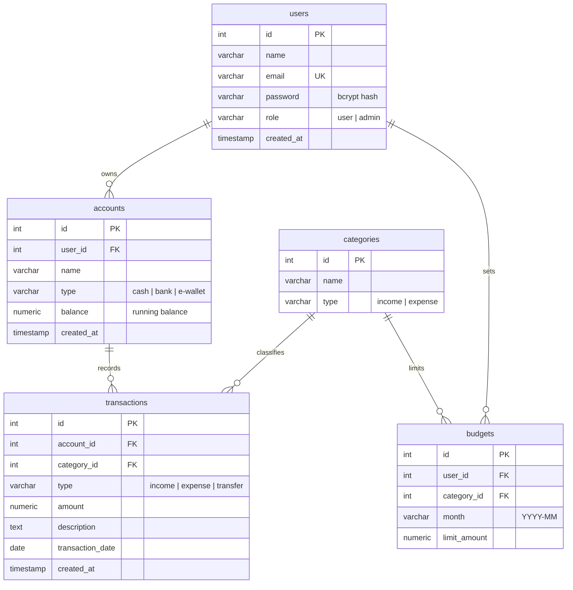

# FinTrack API

FinTrack is a backend for a personal finance / expense tracker (think Mint or Money Lover). A user connects one or more **accounts** (cash, bank, e-wallet), records **transactions** against those accounts, and tags each transaction with a **category** (income or expense) to see where the money flows. Each account keeps a **running balance** that is automatically recalculated whenever a transaction is created, updated, or deleted.

**Stack:** PostgreSQL · Prisma · NestJS · JWT auth (bcrypt) · class-validator · Postman docs.

---

## Entity-Relationship Diagram

The ERD source lives in [`docs/erd.dbml`](docs/erd.dbml). Paste it into [dbdiagram.io](https://dbdiagram.io) and export as `docs/erd.png`. A rendered preview:



> Note: `transactions.type` (income/expense/transfer) is intentionally **distinct** from `categories.type` (income/expense). Money columns use `NUMERIC(12,2)`, never `FLOAT`.

---

## Getting Started

### 1. Prerequisites

- Node.js 20+
- A PostgreSQL database (local via Docker, or hosted on Supabase/Neon/Railway).

Quick local Postgres with Docker:

```bash
docker run --name fintrack-pg -e POSTGRES_PASSWORD=postgres -e POSTGRES_DB=fintrack -p 5432:5432 -d postgres:16
```

### 2. Environment

Copy the example env file and fill in your values:

```bash
cp .env.example .env
```

| Variable       | Description                                             |
| -------------- | ------------------------------------------------------- |
| `DATABASE_URL` | PostgreSQL connection string used by Prisma             |
| `JWT_SECRET`   | Secret used to sign JWT access tokens (long random str) |
| `JWT_EXPIRES_IN` | Access token lifetime (e.g. `1d`)                     |
| `PORT`         | HTTP port (default `3000`)                              |
| `CORS_ORIGINS` | Comma-separated allowed origins                         |

### 3. Install & set up the database

```bash
npm install
npx prisma migrate dev --name init   # create schema from prisma/schema.prisma
npx prisma db seed                   # load sample data (prisma/seed.ts)
```

Seeded logins (password for all: `password123`):

- `alice@fintrack.dev` — **admin**
- `budi@fintrack.dev` — user
- `citra@fintrack.dev` — user

> Re-seed after any `prisma migrate reset`/`migrate dev` that resets the database.

### 4. Run

```bash
npm run start:dev     # watch mode
# or
npm run build && npm run start:prod
```

The API starts on `http://localhost:3000`.

### Running the raw SQL (optional)

The `db/` folder contains hand-written SQL that mirrors the Prisma schema:

```bash
psql "$DATABASE_URL" -f db/schema.sql    # DDL
psql "$DATABASE_URL" -f db/seed.sql      # sample data
psql "$DATABASE_URL" -f db/queries.sql   # 9 analytical queries
```

---

## API Overview

| Resource      | Endpoints                                                        | Auth                          |
| ------------- | --------------------------------------------------------------- | ----------------------------- |
| Auth          | `POST /auth/register`, `POST /auth/login`                       | public (login is rate-limited) |
| Users         | `POST /users`, `GET /users`, `GET /users/:id`                   | create public; reads require JWT |
| Accounts      | full CRUD + `GET /accounts/:id/transactions`                    | JWT + ownership               |
| Categories    | full CRUD                                                        | JWT; `DELETE` is admin-only   |
| Transactions  | full CRUD                                                        | JWT + ownership               |

Full request/response examples: [`docs/api-smoke-test.md`](docs/api-smoke-test.md).
Postman collection & environment: [`docs/fintrack.postman_collection.json`](docs/fintrack.postman_collection.json), [`docs/fintrack.postman_environment.json`](docs/fintrack.postman_environment.json).

---

## Architecture

**Modules.** One module/controller/service per domain: `auth`, `users`, `accounts`, `categories`, `transactions`. A global `PrismaModule` exposes `PrismaService` (which manages the DB connection lifecycle) to every module.

**Dependency injection.** `TransactionsService` depends on a dedicated custom provider, `BalanceCalculatorService`, which owns all balance math. Keeping this logic in a separate injectable (rather than in the controller or inline in the service) makes balance recalculation testable and reusable.

**Balance recalculation.** On transaction create, the signed effect (income `+`, expense `-`, transfer `0`) is applied to the account balance inside a single `prisma.$transaction`. On update, the previous effect is reverted and the new one applied (handling account/amount/type changes). On delete, the effect is reverted. All of this happens in the service layer, never the controller.

**Auth flow.**
1. `POST /auth/register` hashes the password with bcrypt and returns a JWT + sanitized user.
2. `POST /auth/login` verifies the bcrypt hash and issues a JWT (`sub`, `email`, `role`).
3. `JwtStrategy` validates incoming bearer tokens and attaches `{ id, email, role }` to `req.user`.
4. `JwtAuthGuard` protects `accounts` and `transactions` (and user reads).
5. **Ownership** is enforced in the service layer: a user can only read/modify accounts and transactions they own — guessing another user's ID yields `403`.
6. **RBAC** via `RolesGuard` + `@Roles('admin')` restricts `DELETE /categories/:id` to admins.

The password hash is **never** returned in any response — user reads use an explicit Prisma `select`, and auth responses strip the field.

**Middleware & security.**
- A custom `LoggerMiddleware` (registered globally via `configure(consumer)`) logs method, path, status code, and response time.
- `helmet()` sets baseline security headers.
- CORS is configured explicitly from `CORS_ORIGINS` (not wide-open).
- Rate limiting (`@nestjs/throttler`, 5 requests / 60s) is applied **only** to the auth controller so normal CRUD is unaffected.

**Relational queries (Prisma `include`).**
- `GET /accounts/:id/transactions` returns transactions with their `category` nested.
- `GET /users/:id` returns the user with their accounts and a transaction `_count` per account.

---

## Stretch Goal: Budgets

A `budgets` table (`user_id`, `category_id`, `month`, `limit_amount`) is included in the schema, Prisma model, and seed data, plus a budget-vs-actual query in `db/queries.sql`. HTTP endpoints for budgets are not exposed yet — see Known Limitations.

---

## Deployment

Deploy to a public host (Railway, Render, Fly.io, etc.):

1. Provision a managed PostgreSQL instance and set `DATABASE_URL` via the host's env config (never hardcode).
2. Set `JWT_SECRET`, `CORS_ORIGINS`, and `PORT` through the host.
3. Build command: `npm install && npx prisma generate && npm run build`.
4. Release/migrate: `npx prisma migrate deploy` (then `npx prisma db seed` if you want sample data).
5. Start command: `npm run start:prod`.

> Free tiers can sleep or redeploy — re-check the live URL and re-run migrations after redeploys.

---

## Known Limitations

- Budgets exist in the data model only; no CRUD endpoints yet.
- `transfer` transactions are treated as balance-neutral for a single account (no paired double-entry between two accounts).
- Categories are global (not per-user).
- No pagination on list endpoints.
- `GET /users` is available to any authenticated user (not restricted to admins).
